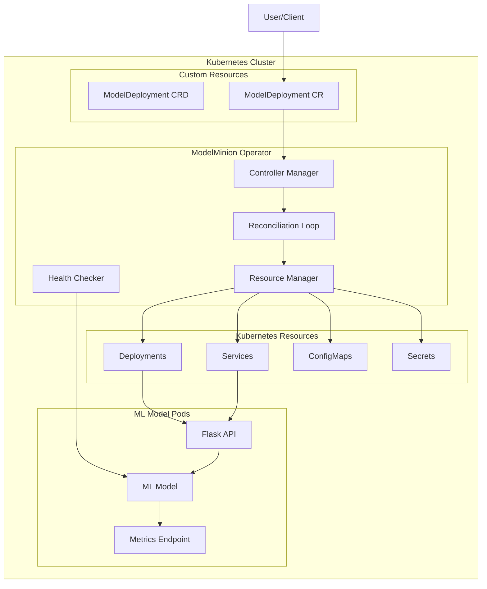

# ModelMinion

A Kubernetes operator for simplifying ML model deployment and management.

## Overview

ModelMinion is a Kubernetes operator designed to streamline the deployment and management of machine learning models. It focuses on simplicity and extensibility, making it easier for teams to manage their ML model lifecycles in Kubernetes environments.

## Features

- Custom Resource Definition (CRD) for model deployments
- Basic model lifecycle management
- Health monitoring
- Status reporting
- Resource management

## Architecture

